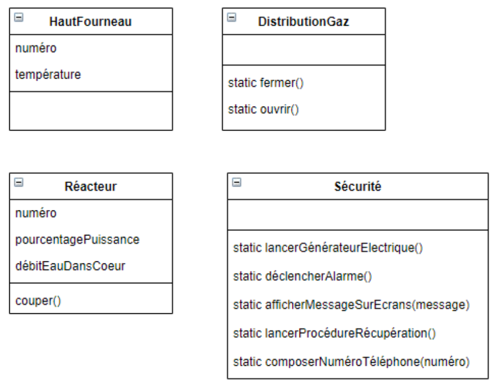

### Exercice 1

Soit un site industriel de type Seveso qui regroupe plusieurs usines, fabriques et
entreprises de production d’énergie.
En cas d’accident sur le site, une procédure complexe doit être appliquée de
façon stricte ; les différentes étapes de la procédure doivent impérativement être
effectuées dans un ordre précis.
La séquence des opérations de sécurisation du site en cas d’accident est la
suivante :
1. Couper les réacteurs 1 et 3 
2. Couper la distribution de gaz
3. Diminuer à 10% la puissance du réacteur 2
4. Augmenter de 50% le débit de l’eau dans le cœur du réacteur 2 (pour accélérer le refroidissement)
5. Baisser la température du haut fourneau numéro 1 à 2000 C
6. Déclencher l’alarme 
7. Afficher sur tous les écrans le message « Évacuation immédiate » 
8. Composer le numéro d’urgence 112
9. Lancer le générateur électrique
10. Lancer la procédure de récupération

Soit le diagramme de classes.

### Quel Design Pattern appliqueriez-vous ?
-  Facade - rendre un systeme complexe simple d'utilisation

### Implémenter en java la classe qui découlerait de l’application de ce Design Pattern.