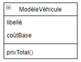
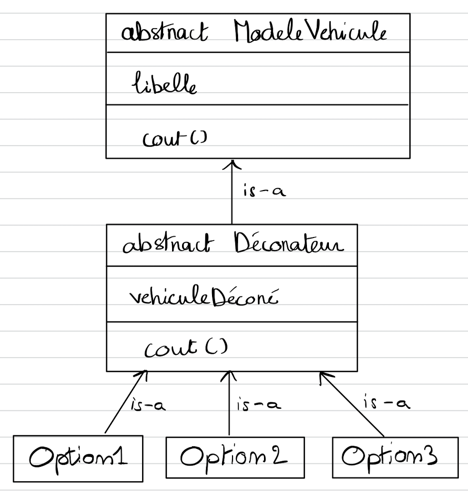

### Exercice 10

Un garage vend différents modèles de véhicule de la même marque.
A chacun des modèles peuvent être ajoutées des options choisies par l’acheteur.
Soit la classe ModèleVéhicule.

### Quel Design Pattern appliqueriez-vous afin que la méthode prixTotal() prenne en compte dans son calcul les suppléments de prix des options éventuelles ajoutées par l’acheteur.

Decorator Pattern afin d'ajouter des options supplementaires au prix initial

### Complétez le diagramme de classe en appliquant ce Design Pattern.

