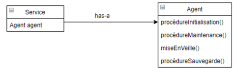
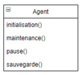

### Exercice 11

Une classe Service appelle les méthodes d’un objet de type Agent.
Soit le diagramme suivant. 

La classe Service possède beaucoup de méthodes (non représentées sur le
schéma ci-dessus dans un souci de visibilité) ; bon nombre d’entre elles appelant
par délégation une ou plusieurs méthodes de la classe Agent via la variable
d’instance agent (ex : agent.miseEnVeille()).

Or, une nouvelle version de la classe Agent est disponible proposant des
méthodes plus performantes. Les programmeurs de la classe Service souhaitent
profiter de cette nouvelle version, car les performances de la classe Service
seront augmentées elles aussi sensiblement. Malheureusement, les noms des
méthodes de la nouvelle version de la classe Agent ont été modifiés.

Soit la nouvelle classe Agent.

Modifier les appels de méthodes correspondant directement dans le code de la
classe Service est impensable car cela nécessiterait la révision d’un nombre trop
important de lignes de code.

### Quel Design Pattern appliqueriez-vous afin de faciliter ce travail de mise à niveau ?

Adapter Pattern afin de rendre les deux interfaces compatibles.

