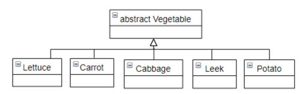
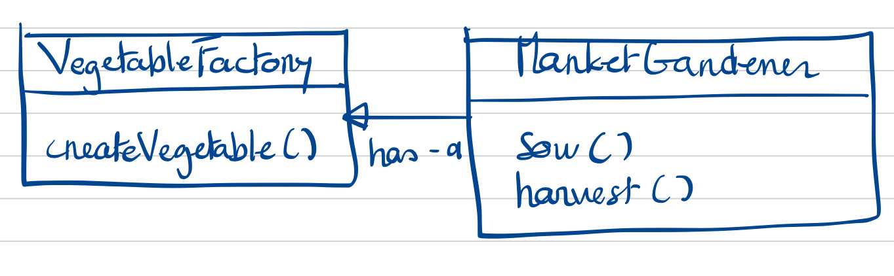

### Exercice 12

Un maraîcher sème et récolte des pommes de terre, des choux, des carottes, des
salades et des poireaux.
Soit la hiérarchie de classes suivante :



Voici le code de la classe Maraîcher (MarketGardener) qu’un étudiant en
informatique a tenté d’écrire et qui contient les méthodes semer (sow) et
récolter (harvest).

```Java
public class MarketGardener {
    public void sow (char code) {
        … // portion de code 1
        Vegetable vegetable;
        switch (code) {
            case 'A': vegetable = new Cabbage();
            case 'B': vegetable = new Carrot();
            case 'C': vegetable = new Leek();
            default : vegetable = new Potato();
        }
        … // portion de code 2
    }
    
    public Vegetable harvest (char code) {
        … // portion de code 3
        Vegetable vegetable;
        switch (code) {
            case 'A': vegetable = new Cabbage();
            case 'B': vegetable = new Carrot();
            case 'C': vegetable = new Leek();
            default : vegetable = new Potato();
        }
        … // portion de code 4
    }
}
```

### Quel Design Pattern appliqueriez-vous pour optimiser le code proposé ci-dessus ?

Les deux fonctions s'occupent principalement de la création d'objets implémentant la classe abstraite Vegetable.
Le design pattern le plus approprié est le Factory Pattern pour encapsuler l'instanciation de classes.

### Créez le diagramme de classe correspondant à ce Design Pattern appliqué au cas traité.



### Réécrivez la classe MarketGardener sur base de ce Design Pattern.