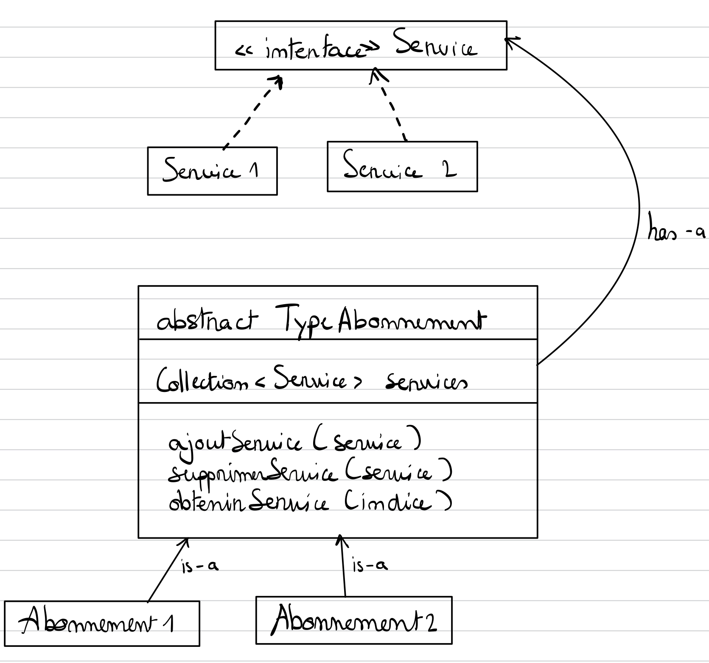

### Exercice 2

Une entreprise de services propose à ses clients plusieurs catégories
d’abonnement, chaque abonnement donnant accès à plusieurs services.
Un client ne peut acheter qu'un seul abonnement et a accès aux services
correspondants.

### Quel Design Pattern vous aiderait à permettre les accès aux services auxquels ont droit les clients ?

PlayerRole pattern

### Donnez le diagramme de classes adapté à ce cas.

