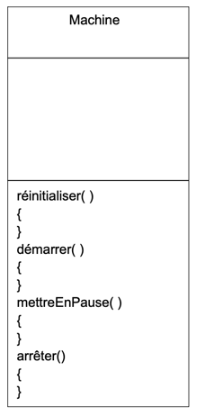

### Exercice 5

Une entreprise doit gérer un parc de machines qui ont trois modes de
fonctionnement : mode normal, mode éco et mode rapide. On peut réinitialiser,
démarrer, mettre en pause ou arrêter chacune de ces machines.
Soit une première ébauche de la classe Machine.

### Quel Design Pattern appliqueriez-vous sachant que l’algorithme des méthodes réinitialiser, démarrer, mettreEnPause et arrêter varie en fonction de l’état courant (normal, éco ou rapide) ?

Le programme change de fonctionnement selon les etats de la machine. State Pattern.

### Compléter le diagramme ci-dessus en appliquant le Design Pattern choisi.

https://web.goodnotes.com/s/PguFoCUnzYyNEzKlqx3qsF