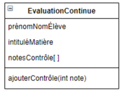

### Exercice 4
Dans une école, un enseignant évalue ses élèves sur une matière sous forme de contrôles (interrogations) réguliers ; une note est attribuée par l’enseignant aux élèves pour chaque contrôle. Soit la classe EvaluationContinue.

#### Quel Design Pattern appliqueriez-vous pour offrir au programmeur qui utilise la classe EvaluationContinue la possibilité de boucler sur la collection des notes des contrôles ?

Iterator Pattern dès qu'il faut itérer sur une collection d'objets

- #### Implémenter en java ce Design Pattern dans la classe EvaluationContinue, en implémentant la collection notesContrôles sous forme de tableau.

  - Interface Aggregate: implémentée par EvaluationContinue
  - Interface Iterator: implémentée par EvaluationsIteratorArray

- #### Implémenter en java ce Design Pattern dans la classe EvaluationContinue, en implémentant la collection notesContrôles sous forme de ArrayList.

    - Interface Aggregate: implémentée par EvaluationContinue
    - Interface Iterator: implémentée par EvaluationsIterator