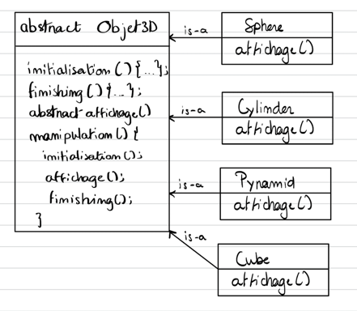

### Exercice 4

Un programme doit manipuler des objets en 3 dimensions, à savoir, des cubes,
des sphères, des cylindres et des pyramides. Quatre classes sont donc créées :
Cube, Sphere, Cylinder et Pyramid.
Chaque manipulation d’un objet 3D nécessite trois étapes : une étape
d’initialisation, une étape d’affichage et une étape de finition. Les étapes
d’initialisation et de finition sont des étapes longues et complexes mais leurs
algorithmes sont les mêmes pour tous les objets 3D ; seul l’algorithme
d’affichage diffère d’un objet 3D à l’autre.

Voici le code des 3 classes:

```java
public class Cube {
    public void manipulation() {
        initialisation() ;
        … // code d’affichage du cube
        finishing() ;
    }
    public void initialisation() {
        …
    }
    
    public void finishing() {
        …
    }
}


public class Sphere {
    public void manipulation() {
        initialisation() ;
        … // code d’affichage du cube
        finishing() ;
    }
    public void initialisation() {
        …
    }
    
    public void finishing() {
        …
    }
}


public class Cylinder {
    public void manipulation() {
        initialisation() ;
        … // code d’affichage du cube
        finishing() ;
    }
    public void initialisation() {
        …
    }
    
    public void finishing() {
        …
    }
}


public class Pyramid {
    public void manipulation() {
        initialisation() ;
        … // code d’affichage du cube
        finishing() ;
    }
    public void initialisation() {
        …
    }
    
    public void finishing() {
        …
    }
}
```

### Quel Design Pattern appliqueriez-vous pour éviter la redondance de code ?

Template Method Pattern. Le même code est appliqué à toutes les classes à quelques instructions près.

### Donnez le diagramme de classe de ce Design pattern appliqué au cas traité.


### Corrigez le code des classes Java en appliquant ce Design Pattern.