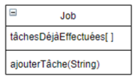

### Exercice 8

Une entreprise a structuré ses travaux sous forme de jobs. Il est important pour
l’entreprise de pouvoir retrouver le plus précisément possible la liste des tâches
déjà effectuées pour chaque job.
Soit la classe Job.

L’entreprise souhaite lancer à intervalles réguliers une procédure de sauvegarde
des tâches déjà effectuées sur chaque job en vue de pouvoir restaurer une telle
liste en cas de suppression malencontreuse de la liste des tâches déjà réalisées
sur un job donné.

### Quel Design Pattern appliqueriez-vous ?

Memento Pattern pour sauvegarder l'état d'un objet, le stocker dans une collection et pouvoir les restaurer par après

### Implémenter en java ce Design Pattern, tout en simulant dans la méthode main la récupération de la dernière liste des tâches réalisées sur un job donné.