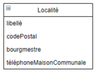

### Exercice 9

Un programme doit gérer une quantité non négligeable d’adresses en Belgique et
donc créer des objets de la classe Localité que voici.

Bon nombre des clients habitent une même localité. Par conséquent, une fois la
localité créée, les programmeurs souhaitent pouvoir récupérer et utiliser ce
même objet pour tous les futurs clients qui habitent cette localité. Ils souhaitent
ainsi ne pas devoir réécrire le nom du bourgmestre et le numéro du central
téléphonique de la maison communale des localités qu’ils ont déjà créées
précédemment dans le programme.

### Quel Design Pattern appliqueriez-vous ?

Flyweight Pattern pour empêcher la création d'objets déjà existants avec des paramètres identiques

### Implémenter en java ce Design Pattern.